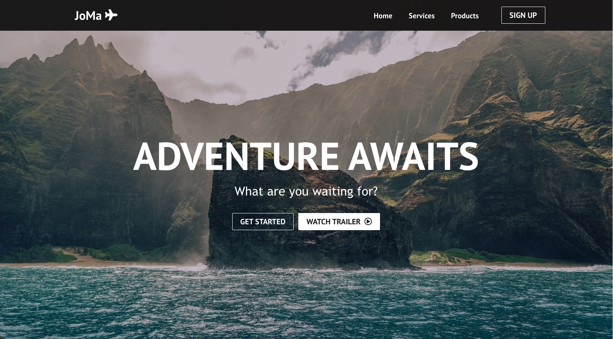
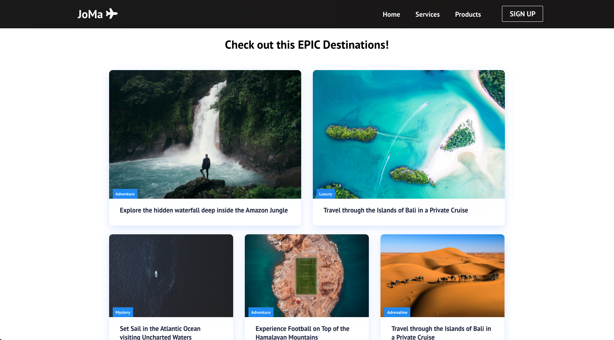

# React.JS Travel App

Fully responsive Travel app, where I practice my styling skills using React.JS framework and Bootstrap.

## ⚙️ Technologies Used

- React.js
- JavaScript
- HTML5
- CSS/Bootstrap
- GitHub
- Netlify

## 📷 Screenshots

- Website

- Website/2

## 🔌 Getting Started
[Click](https://joseramdonwebsitee.netlify.app/) to get started and see the app live!

## 🛠 Future Enhancements

- Have more content display in the Services and Products section.